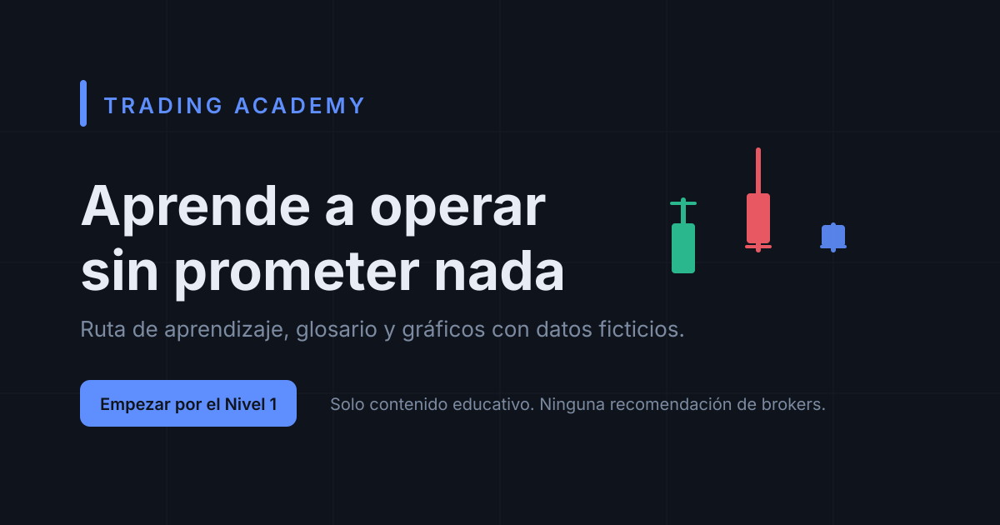

# LearnTrading

> Plataforma educativa en español para aprender trading desde cero: ruta de aprendizaje de 7 niveles, gráficos explicativos, diccionario, blog y simulador de riesgo. **Sin promesas de rentabilidad y sin datos de mercado reales.**




## Qué es LearnTrading

LearnTrading es un sitio estático (SSG) pensado para quien nunca ha operado. El contenido está escrito para leerse de principio a fin, con progreso guardado en el navegador, ejemplos numéricos verificables y gráficos deterministas: el mismo lección muestra siempre la misma figura, con datos **ficticios** generados por una semilla.

No recomienda brokers, no publica señales y no simula cuentas reales. El simulador calcula riesgo, tamaño de posición y relación riesgo/beneficio con cifras que tú introduces.

## Contenido

| Nivel | Ruta | Lecciones |
| --- | --- | ---: |
| 1 · Fundamentos | `/ruta/nivel-1-fundamentos` | 8 |
| 2 · Gráficos | `/ruta/nivel-2-graficos` | 8 |
| 3 · Gestión de operaciones | `/ruta/nivel-3-gestion-de-operaciones` | 8 |
| 4 · Análisis técnico | `/ruta/nivel-4-analisis-tecnico` | 8 |
| 5 · Estrategias | `/ruta/nivel-5-estrategias` | 7 |
| 6 · Gestión del riesgo | `/ruta/nivel-6-gestion-del-riesgo` | 7 |
| 7 · Psicología | `/ruta/nivel-7-psicologia` | 7 |

- **53 lecciones** con explicación, ejemplo, gráfico, escenario de operación, errores comunes y cuestionario de 4 preguntas.
- **67 términos** en el diccionario, con definición corta y ampliada.
- **12 artículos** en el blog.
- **149 páginas** prerenderizadas en cada build (lecciones, términos, artículos y páginas institucionales).

## Características

- **Ruta de aprendizaje** progresiva: cada lección desbloquea su cuestionario y marca el progreso por nivel.
- **Dashboard** con progreso global, lecciones completadas y días de estudio.
- **Laboratorio de gráficos**: velas japonesas, indicadores (RSI, MACD, Bollinger, medias móviles) y patrones con presets deterministas.
- **Simulador educativo**: tamaño de posición, stop loss, take profit, costes y relación riesgo/beneficio.
- **SEO y accesibilidad**: metadescripciones por ruta, Open Graph, canonical, sitemap/robots generados, `lang="es"`, navegación por teclado y modo claro/oscuro.
- **Responsive**: de móvil a escritorio, sin framework de componentes externo.

## Stack técnico

| Capa | Tecnología |
| --- | --- |
| Routing y SSG | React Router 7 (`ssr: false` + prerender) |
| Build | Vite 8 + Rolldown |
| Estilos | Tailwind CSS 4 (tokens CSS, sin config JS) |
| Tipos | TypeScript 5.9 (`strict`) |
| Tests | Vitest 5 |
| Lint | ESLint 10 + typescript-eslint |
| Gráficos | SVG propio (sin librería de charts) |

## Requisitos

- Node.js **>= 22.18.0** (ver `engines` en `package.json`)
- npm 10+

## Puesta en marcha

```bash
npm install        # instalar dependencias
npm run dev        # servidor de desarrollo (http://localhost:5173)
```

## Scripts disponibles

| Comando | Qué hace |
| --- | --- |
| `npm run dev` | Servidor de desarrollo con HMR |
| `npm run build` | Genera sitemap/robots y compila + prerenderiza las 149 páginas |
| `npm run preview` | Sirve el build en local |
| `npm run typecheck` | `react-router typegen` + `tsc --noEmit` |
| `npm run lint` | ESLint con `--max-warnings 0` |
| `npm test` | Vitest (31 pruebas: contenido, indicadores, riesgo) |
| `npm run seo:generate` | Regenera `sitemap.xml` y `robots.txt` |
| `npx tsx scripts/check-content.ts` | Detecta texto corrupto/mojibake en el contenido |

## Estructura del proyecto

```
app/
  root.tsx            Layout raíz, tema y metadatos globales
  routes.ts           Configuración de rutas (RouteConfig)
  routes/             Una página por archivo (ruta.*, blog.*, diccionario.*)
src/
  components/
    ui/               Card, Button, Badge, Alert, Progress...
    layout/           RootLayout, Reveal (animaciones)
    charts/           CandleChart, IndicatorChart, ChartRenderer
    ads/              AdSlot (deshabilitado por defecto)
  data/
    site.ts           Configuración, niveles y categorías
    lessons/          nivel-1.ts ... nivel-7.ts + registro central
    dictionary.ts     67 términos
    blog.ts           12 artículos
    charts/presets.ts Presets de gráficos deterministas
  hooks/              Progreso, tema e interfaz (localStorage)
  utils/              riskMath, indicators, format, meta, fakeMarket
  types/              Modelos de datos compartidos
scripts/
  generate-seo.ts     sitemap.xml + robots.txt
  check-content.ts    Validador de texto
public/               Favicon, OG, manifest
```

## Notas de implementación

- **Datos ficticios**: `fakeMarket.ts` genera series de precios por semilla (`hashSeed`); no hay llamadas a APIs ni precios reales.
- **Progreso local**: `localStorage` con las claves `ta:progress:v1`, `ta:theme` y `ta:study-days`. No se envía nada a ningún servidor.
- **Metadatos**: cada ruta declara su `meta` con el helper `src/utils/meta.ts`; `root.tsx` inyecta los tags globales de Open Graph.
- **Ads y newsletter**: `site.ads.enabled` y `site.newsletter.enabled` están en `false`.

## Aviso legal

El contenido es **únicamente educativo**. Operar con instrumentos financieros implica riesgo de pérdida de capital; el apalancamiento multiplica tanto las ganancias como las pérdidas. Ninguna lección, gráfico o resultado simulado constituye una recomendación de inversión.

## Licencia

Contenido y código con fines educativos. Consulta el [aviso legal](https://github.com/AsllyZuniga/LearnTrading) del sitio para más detalles.
